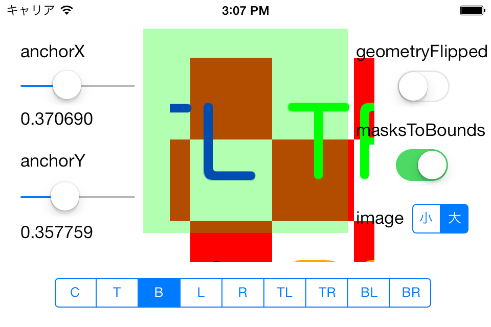

CALayer
==========

CALayerクラスのプロパティを理解するために作ったサンプルです。

理解するのに時間がかかったのが、contentsGravity プロパティの振る舞いです。例えば kCAGravityBottom に設定したら、画面上で「下」に張り付くと思っていたのですが、なぜか「上」に行ってしまいます。どうやら、座標系における「上」「下」をあらわしているようです。iOS の CALayer では、座標系は下方向に Y が増加するのでアベコベになっているように思ってしまいました。ですので geometryFlipped プロパティを YES に設定すると、画面上の「上」「下」と contentsGravity プロパティ用定数の名前が一致して感じられます。

